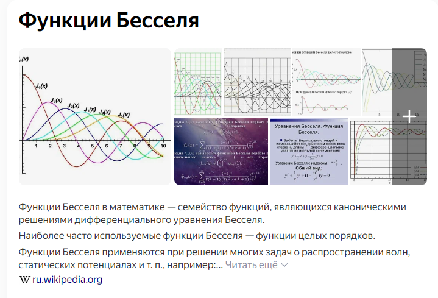
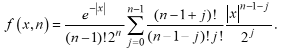

Для начала, мы выполняем лабу на стандартный уровень (для начала):

**Уровень выполнения № 2 (стандартный), максимум 20 баллов за выполнение.**

1. Разработать программу, которая реализует:

    1.1) генерацию наборов данных с заданным в варианте чистым распределением и засоренным распределением, использовать засоряющие распределения, совпадающие с чистым с точностью до значений параметров сдвига и масштаба;

    1.2) вычисление выборочных характеристик: среднего арифметического, выборочной медианы, дисперсии, коэффициентов асимметрии и эксцесса;

    1.3) вычисление усеченного среднего, оценки максимального правдоподобия и обобщенных радикальных оценок параметра сдвига модельного распределения;

    1.4) вычисление математического ожидания, дисперсии, коэффициентов асимметрии и эксцесса случайной величины с засоренным распределением по заданным характеристикам чистого и засоряющего распределений.

2. Провести проверку генератора чистого и засоренного распределений путем сравнения выборочных характеристик (см. пп. 1.2) с их теоретическими значениями на выборках большого объема (N порядка 104–107); как альтернативу можно использовать какие-либо критерии согласия, в том числе с использованием стороннего программного обеспечения.

3. Для выборок с разными видами распределений вычислить следующие оценки параметра сдвига:
– среднее арифметическое;
– выборочная медиана;
– оценка максимального правдоподобия;
– усеченное среднее с разными уровнями (как минимум три обязательных зна-чения 0.05, 0.10, 0.15);
– обобщенные радикальные оценки с разными значениями параметра (как минимум три обязательных значения 0.1, 0.5, 1).
Использовать выборки, имеющие следующие виды распределений:
– чистое распределение; 
– засоренное распределение с симметричным засорением (равные сдвиги у чи-стого и засоряющего распределений, масштаб у засоряющего больше в 2-4 раза, чем у чистого);
– засоренное распределение с асимметричным засорением (сдвиги у чистого и засоряющего распределений отличаются на 2-4 стандартных отклонения, масштаб у засоряющего распределения не меньше, чем у  чистого). 
При выборе параметров засорения ориентироваться на график чистой, засоря-ющей и засоренной плотностей. Рекомендуемый уровень засорения  :  . Ре-комендуемый объем выборки  :  . Сравнить устойчивость оценок для рас-пределений указанных видов (минимум по три выборки с одинаковыми значениями всех параметров) по их отклонению от истинного значения, сопоставить результаты сравнения со свойствами функций влияния оценок.

4. Оформить отчет по проделанной работе. Отчет должен содержать постанов-ку задачи, описание и результаты работы, выводы, текст программы. Для каждого рассмотренного засоренного распределения привести график, на котором сравнить чистую, засоряющую и засоренную плотности. Привести график с функциями влия-ния для всех использованных оценок.

5. Защитить работу.

### Поясняющие моменты:

***Обобщенное распределение Лапласа.*** 

Обобщенное распределение Лапласа (распределение гамма-дисперсии, распределение функции Бесселя: https://ru.wikipedia.org/wiki/%D0%A4%D1%83%D0%BD%D0%BA%D1%86%D0%B8%D0%B8_%D0%91%D0%B5%D1%81%D1%81%D0%B5%D0%BB%D1%8F 
) при натуральном параметре формы имеет плотность:

Такое распределение будет иметь сумма   независимых лапласовских случайных ве-личин. При увеличении параметра   распределение приближается к нормальному с неограниченным ростом дисперсии. Случайная величина имеет: 
- дисперсию (мера, которая показывает разброс между результатами)  , 
- коэффициент эксцесса (это мера остроты пика в распределении случайной величи-ны)  .
